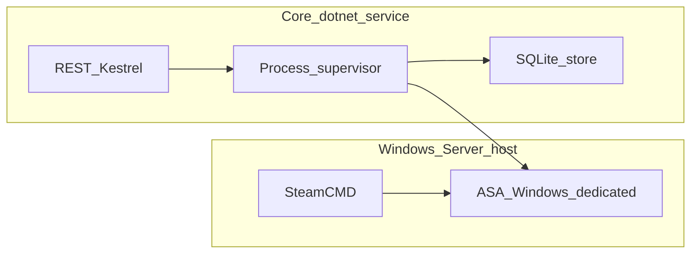

> Planning snapshot — cite ADRs and `raw/` for factual claims; refresh when gates change.

# Overview

ARK Ascended Server Manager is a **control plane** for dedicated ASA servers: lifecycle (install/update/start/stop), configuration, mods, backups, observability, and an API-first surface with optional UI.

## Planning stance

- Detailed module bullets live under [product/](../product/).
- **MVP contract**: [requirements/mvp-scope.md](requirements/mvp-scope.md).
- **REST v1 (MVP)**: [requirements/api-v1-mvp.md](requirements/api-v1-mvp.md).
- **Persistence providers**: [architecture/persistence-providers.md](architecture/persistence-providers.md).
- **ASA pitfalls**: [risks/asa-known-issues.md](risks/asa-known-issues.md).
- **Execution order (when coding)**: [implementation-backbone.md](implementation-backbone.md).
- **Open queue**: [open-questions.md](open-questions.md) (resolved items archived there).
- **Decisions**: ADRs under [decisions/](decisions/) — start with [ADR-0001](decisions/ADR-0001-host-and-deployment.md), [ADR-0003](decisions/ADR-0003-secrets-and-exposure.md), [ADR-0002](decisions/ADR-0002-plugin-integration.md).
- **Risks / threat model**: [risks/threat-model-stub.md](risks/threat-model-stub.md).
- Pre-split outline snapshot (immutable): [raw/legacy-ark-server-manager-plan-monolith.md](../raw/legacy-ark-server-manager-plan-monolith.md).

## Product modules (navigation)

| Area | Doc |
|------|-----|
| Foundations, models, state | [product/00-foundations.md](../product/00-foundations.md) |
| Lifecycle, SteamCMD | [product/01-lifecycle.md](../product/01-lifecycle.md) |
| Updates, scheduler, queue | [product/02-updates-automation.md](../product/02-updates-automation.md) |
| Mods | [product/03-mods.md](../product/03-mods.md) |
| RCON / players | [product/04-players-rcon.md](../product/04-players-rcon.md) |
| Monitoring | [product/05-monitoring.md](../product/05-monitoring.md) |
| INI / config | [product/06-config-ini.md](../product/06-config-ini.md) |
| Backups | [product/07-backups.md](../product/07-backups.md) |
| API / WebSocket | [product/08-api.md](../product/08-api.md) |
| UI | [product/09-ui.md](../product/09-ui.md) |
| Integrations | [product/10-integrations.md](../product/10-integrations.md) |
| Security | [product/11-security.md](../product/11-security.md) |
| Deployment | [product/12-deployment.md](../product/12-deployment.md) |
| Advanced | [product/13-advanced.md](../product/13-advanced.md) |
| Extensibility | [product/extensibility-ui-plugins.md](../product/extensibility-ui-plugins.md) |

## Architecture snapshot (accepted for MVP)

- **Host**: Windows Server; manager runs as a **Windows Service** ([ADR-0001](decisions/ADR-0001-host-and-deployment.md)).
- **Stack**: **C# / .NET 8** Worker + ASP.NET Core ([architecture/tech-stack.md](architecture/tech-stack.md)).
- **Data**: `%ProgramData%\ArkServerManager\` default root; per-server tree per [architecture/data-layout-windows.md](architecture/data-layout-windows.md).
- **Persistence**: SQLite for registry/state ([product/00-foundations.md](../product/00-foundations.md)).
- **API security**: loopback default + `X-Api-Key` ([ADR-0003](decisions/ADR-0003-secrets-and-exposure.md)).
- **Plugins / external UI contributions**: **deferred** post-MVP trigger ([ADR-0002](decisions/ADR-0002-plugin-integration.md)).

## Sources

- [product/00-foundations.md](../product/00-foundations.md)
- [mvp-scope.md](requirements/mvp-scope.md)
- [raw/legacy-ark-server-manager-plan-monolith.md](../raw/legacy-ark-server-manager-plan-monolith.md)
- [LLM Wiki pattern (gist)](https://gist.github.com/karpathy/442a6bf555914893e9891c11519de94f)
